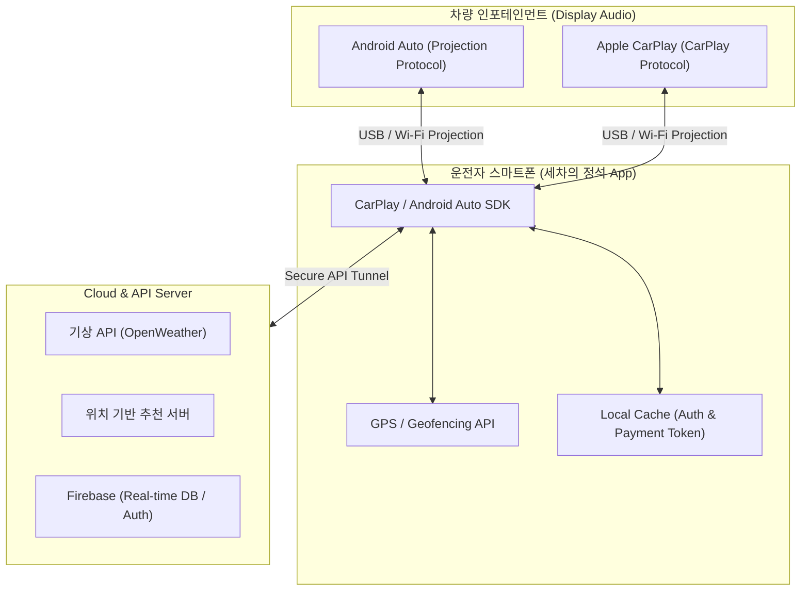

# 세차의 정석 (The Art of Car Wash) 🧼✨

**세차의 정석**은 프리미엄 차량 관리에 대한 UX 혁신을 목표로 개발된 **지능형 하이엔드 컨시어지 솔루션**입니다. 단순한 세차 정보 제공을 넘어, AI 비전 분석, 전문가 실시간 매칭, 데이터 기반의 정량적 리포트 시스템을 한데 모은 통합 플랫폼입니다.

---

## 🎨 Design Identity & UX Strategy

본 프로젝트는 사용자에게 신뢰감과 전문성을 전달하기 위해 다음과 같은 디자인 원칙을 준수했습니다.

-   **Deep Slate & Emerald Palette**: 전문성과 청결함을 상징하는 딥 슬레이트와 에메랄드 그린 컬러를 메인 테마로 채택하여 세련된 인터페이스를 구축했습니다.
-   **Micro-Interactions**: 모든 뷰 전환 및 버튼 인터랙션에 `Framer Motion`을 적용하여 리드미컬하고 매끄러운 유저 경험(App-like Experience)을 제공합니다.
-   **Adaptive Layout**: 모바일 웹 환경에 최적화된 하단 탭 내비게이션과 카드 UI를 통해 한 손 조작 편의성을 극대화했습니다.

---

## 🚀 Key Features (Core Functionalities)

### 1. 지능형 실시간 세차 지수 (Wash Index)
-   OpenWeather 및 미세먼지 API 데이터를 실시간 대조 가공하여, 향후 48시간 내 최적의 세차 타이밍을 0~90% 수치로 가시화합니다.

### 2. 하이브리드 AI 도슨트 시스템
-   **AI Vision Analysis (스마트 오염도 진단 및 솔루션 제시)**:
    - **기존의 문제점**: 사용자가 차량의 오염도에 맞는 세차 방법이나 적정 소요 시간을 스스로 파악하고 결정하기 어렵다는 한계가 있었습니다.
    - **AI 카메라 기반 해결책**: `Google Gemini 1.5 Flash` 모델을 연동하여, 사용자가 카메라로 촬영하거나 업로드한 차량 사진을 실시간으로 분석합니다. 분석된 오염도에 따라 **자세한 세차 소요 시간**과 **최적의 세차 방법**을 구체적으로 제시합니다. 만약 오염도가 너무 높거나 일반 고객이 직접 해결하기 어려운 상태라고 판단될 경우, AI가 **"전문 디테일링 세차장과 상담을 진행해 보세요."**라고 안전한 대안을 제시하여 차량 손상을 방지합니다.
-   **다양한 세차용품 맞춤 추천 (AI API 연동)**: 생성형 AI API를 활용하여 사용자의 세차 성향과 차량 상태, 오염도 데이터를 종합적으로 분석하여 수많은 세차 용품(카샴푸, 코팅제, 타월 등) 중 가장 최적화된 제품 라인업을 스마트하게 큐레이션 및 추천합니다.
-   **Expert Live Chat**: Firebase SDK를 이용한 실시간 데이터 스트리밍으로 현장 전문가와 1:1 상담 세션을 유지합니다.

### 3. 고속 위치 기반 탐색 (Quick Location Service)
-   **Searching Splash UX**: 기기 GPS와 통신하는 찰나의 대기 시간을 감각적인 애니메이션 스플래시로 처리하여 지루함을 최소화했습니다.
-   **Native Map Deep-link**: 사용자 선택에 따라 네이버 지도 혹은 카카오 맵 앱으로 직접 좌표 정보를 전달하여 즉각적인 길 안내를 지원합니다.

### 4. 정량적 세차 품질 검증 (Matrix Report)
-   **2D Matrix UI**: 세차 품질(세밀함)과 소요 시간을 2축 좌표계로 시각화하여, 서비스 만족도를 데이터 중심으로 평가합니다.
-   **Automated AI Summary**: 수집된 평가 데이터를 바탕으로 AI가 핵심 인사이트를 요약하여 리포트를 발행합니다.

### 5. 마스터 관리 대시보드 (Admin Dashboard)
-   **RBAC (Role-Based Access Control)**: 특정 관리자 계정(`wlsgns9607@gmail.com`)에만 활성화되는 전용 대시보드를 통해 실시간 상담 현황과 리뷰 데이터를 통합 모니터링합니다.


## 🔮 대기업 협업 및 인프라 연동이 필수적인 다음 단계 기능 (Next Version)
> **"단독 앱 단위로는 당장 구현 불가능하며, 대기업(현대자동차 Connected Car API, Apple CarPlay / Google Android Auto SDK) 및 오프라인 프랜차이즈 결제망 인프라 연동 협업이 전제되어야 비로소 실현 가능한 차세대 확장 스펙입니다."**

### 1. 서울 중심 인프라 기반 시간 축소 결제 시스템 (Time-Reduction Payment Infra)
- **시간 축소형 선결제 프로세스**: 현장에 도착해 키오스크 앞에서 지갑을 꺼내거나 앱을 켜서 결제하느라 낭비되던 불필요한 '대기 시간'을 완벽하게 삭제합니다. 차량 디스플레이에서 진입 전 결제가 완료되므로 현장 프로세스가 획기적으로 단축됩니다.
- **서울 거점 중심의 인프라 빌드업**: 차량 통행량과 프리미엄 세차 수요가 가장 밀집된 '서울 중심 주요 세차장'을 1차 거점으로 지정하여 결제 연동 인프라를 우선 구축합니다. 이를 통해 강남, 서초, 성수 등 핵심 타깃 지역 내에서 완벽한 "시간 축소형 세차 생태계"를 실현합니다.

### 2. 🚗 In-Car Infotainment (Android Auto / Apple CarPlay) UX Extended Architecture (차량 인포테인먼트 연동)
> **"교과서적인 스마트폰 화면을 넘어, 운전자가 진짜 서비스를 소비하는 차량 내비게이션 디스플레이로 UX 생태계를 확장합니다."**

#### A. 프로젝트 개요 (Overview)
기존 모바일 앱 중심의 세차 예약 서비스를 스마트폰 화면(In-App)에만 가두지 않고, 차량 인포테인먼트 시스템(**Android Auto / Apple CarPlay**)과 USB 및 무선으로 연동합니다. 운전석에 앉아 차량 내비게이션 화면만으로 실시간 도장면 케어 알림, 세차장 예약, 자동 체크인까지 원스톱으로 해결하는 **'드라이버 중심의 실전형 카케어 UX 플랫폼'**입니다.

#### B. 핵심 기능 및 차량 내 UX 동선 (Key Features & In-Car UX)
*   **실시간 주행 데이터 연동 알림 (Smart Driving Alert)**:
    *   *Context-Aware 팝업*: 차량 GPS 기반 기상 데이터(우천, 황사 등) 및 장거리 주행 데이터를 분석하여, 차량 시동을 끄거나 신호 대기 시 내비게이션 화면에 세차 타이밍 알림을 직관적으로 노출합니다.
    *   *Actionable UI*: 알림을 터치하는 순간, 복잡한 뎁스 없이 바로 근처 '세차의 정석' 최적 동선 제휴점 추천 화면으로 전환됩니다.
*   **차량 디스플레이 최적화 1-Touch 예약/결제 (In-Car Reservation)**:
    *   *드라이빙 안전 가이드 적용*: 주행 중 조작을 최소화하기 위해 큼직하고 시인성 높은 버튼 배치(Big Button UI)를 채택했습니다.
    *   *간편 결제 스킵*: 연동된 차량 내 간편 결제 시스템을 통해 운전석에서 터치 단 한 번으로 예약을 확정합니다.
*   **세차장 진입 시 자동 무인 체크인 (Geofencing Welcome System)**:
    *   *비대면 프리패스 동선*: 예약된 '세차의 정석' 매장 반경 50m 진입 시, 차량 GPS(Geofencing)가 이를 자동 감지합니다.
    *   *실시간 베이(Bay) 안내*: 차량 화면에 `"진훈 오너님 환영합니다. 예약하신 3번 베이로 바로 진입해 주세요."`라는 UI 안내 가이드를 띄워, 현장에서 대기하거나 차에서 내릴 필요 없는 극강의 편리함을 제공합니다.

#### C. 시스템 연동 구조 (Wired & Wireless Connectivity)



*   **유무선 프로젝션 (Projection Protocol)**: 모바일 기기와 차량 헤드유닛 간의 USB(유선) 혹은 Wi-Fi/Bluetooth(무선) 통신을 통해 화면 정보 및 터치 이벤트를 주고받습니다.
*   **차량용 SDK 적용**: Android Auto의 `Car App Library` 및 Apple CarPlay의 `CarPlay framework` 가이드라인을 엄격히 준수하여 템플릿 기반 안전한 시인성을 보장합니다.
*   **초저지연 GPS 동기화**: 모바일의 기지국 및 GPS 데이터와 차량의 외부 GPS 데이터를 하이브리드로 대조하여 정밀한 지오펜싱(Geofencing)을 구현합니다.

---

## 🛠 Tech Stack (Architecture)

-   **Core**: React 18 (Hooks), TypeScript, Vite
-   **Styling**: Tailwind CSS, Framer Motion
-   **Backend & Infrastructure**: 
    -   **Firebase**: Authentication (Google/Email), Cloud Firestore (Real-time DB)
    -   **AI**: Google Generative AI (Gemini SDK) via Secure API Proxy Server
-   **Deployment**: Cloud Run (Containerized)

---

## 🌐 Deployment Guide (for Portfolio)

본 프로젝트는 Vercel 혹은 Cloud Run에 즉시 배포 가능하도록 환경이 최적화되어 있습니다.

### 1. Firebase 설정
1. [Firebase Console](https://console.firebase.google.com/)에서 프로젝트 생성.
2. `Firestore Database` 및 `Authentication` (Google, Email) 활성화.
3. 프로젝트 루트의 `firestore.rules`를 Firebase 규칙 탭에 배포.

### 2. 환경 변수 (`.env`) 설정
`.env.example` 파일을 참고하여 다음 변수들을 등록합니다.
```env
# Client-side (Vite)
VITE_FIREBASE_API_KEY=...
VITE_FIREBASE_AUTH_DOMAIN=...
VITE_FIREBASE_PROJECT_ID=...
VITE_FIREBASE_STORAGE_BUCKET=...
VITE_FIREBASE_MESSAGING_SENDER_ID=...
VITE_FIREBASE_APP_ID=...

# Social Login (Vite)
VITE_NAVER_CLIENT_ID=...
VITE_KAKAO_CLIENT_ID=...

# Server-side (Private Secrets)
GEMINI_API_KEY=...
NAVER_CLIENT_SECRET=...
KAKAO_CLIENT_SECRET=...
```

### 3. 로컬 실행
```bash
npm install
npm run dev
```

---

## 📍 위치 서비스 기능 시연 시 주의사항 (필독)

본 프로젝트의 '빠른 위치 서비스(가까운 세차장 찾기)' 기능은 시뮬레이션이 아닌 **실제 스마트폰 기기의 GPS 데이터(`navigator.geolocation`)**를 활용하여 동작합니다. 원활한 시연을 위해 아래 사항을 반드시 숙지해 주십시오.

1. **위치 권한 팝업 [허용] 필수**
   - 기능을 처음 실행하면 브라우저 상단(또는 하단)에 **"이 웹사이트에서 기기의 위치 정보를 사용하려고 합니다"**라는 알림창이 나타납니다.
   - 이때 반드시 **[허용]**을 눌러야만 기기의 위도/경도를 정상적으로 수집하여 네이버 지도나 카카오맵으로 정확하게 연동할 수 있습니다.
2. **차단 시 동작 방식**
   - 만약 실수로 권한을 차단(거부)할 경우, 앱이 다운되지 않고 **"위치 권한이 거부되었습니다. 설정에서 브라우저의 위치 권한을 허용해주세요."**라는 예외 처리 알림이 정상적으로 작동하도록 안전하게 설계되어 있습니다.
3. **HTTPS 환경 필수 (Vercel)**
   - 브라우저 보안 정책상 위치 서비스는 보안 연결(HTTPS) 환경에서만 작동합니다. 로컬 테스트가 아닌 **Vercel에 배포된 공식 URL**로 접속하여 시연해야 완벽하게 구동됩니다.


---

## 💡 UX 기획 의도 및 비전 (UX Design Insights & Vision)

### ⏳ 시간 축소(Time-Reduction) 개념의 완벽한 구현
* **세차장 비즈니스의 본질 재정의**: 세차장의 진짜 핵심 가치는 단순히 '차를 깨끗하게 닦는 것'을 넘어, 고객이 현장에서 낭비하는 **'머무는 시간과 진입 장벽을 얼마나 혁신적으로 줄이느냐'**에 있습니다.
* **딜레이 제로(Delay-Zero) 생태계 구축**: 기획자가 설계한 '서울 중심 선결제 인프라'와 차량 인포테인먼트가 결합되면, 오너는 차에서 내릴 필요도 없이 **[진입 ──▶ 세차 ──▶ 출차]**까지 이어지는 전 과정에서 단 1초의 버려지는 시간도 없이 극강의 시간 효율성을 경험하게 됩니다.
* **실전형 오프라인 연동**: 핀터레스트에 널린 뻔한 '보여주기식 쇼핑몰 UI' 디자인에서 탈피하여, 실제 서울 중심 오프라인 인프라의 동선 자체를 설계하는 **'비즈니스 임팩트 중심의 탑티어 UX 기획'**을 증명합니다.

---

## 📝 Portfolio Note
이 프로젝트는 단순한 코딩을 넘어 **"사용자가 기술을 통해 어떻게 더 나은 일상을 경험할 수 있는가"**에 대한 고민을 담았습니다. 특히 위치 정보 접근 권한 획득 시의 UX 처리와 AI를 활용한 비주얼 분석 기능은 차별화된 기술적 셀링 포인트입니다.

---
**Contact & Feedback**: wlsgns9607@gmail.com


--------------------
## 🚀 Vercel 배포 시 API 연동 가이드

Vercel에 배포할 때 소셜 로그인(네이버/카카오) 및 AI 기능을 정상적으로 사용하려면 대시보드의 **Settings > Environment Variables** 메뉴에서 다음 변수들을 반드시 등록해야 합니다.

### 1. 필수 환경 변수 목록

| 변수명 | 설명 | 비고 |
| :--- | :--- | :--- |
| `GEMINI_API_KEY` | Google Gemini AI 인증 키 | [Google AI Studio](https://aistudio.google.com/app/apikey)에서 발급 |
| `VITE_NAVER_CLIENT_ID` | 네이버 개발자 센터 Client ID | 클라이언트 사이드 사용 (`VITE_` 접두사 필수) |
| `NAVER_CLIENT_SECRET` | 네이버 개발자 센터 Client Secret | 서버 사이드 보안 키 |
| `VITE_KAKAO_CLIENT_ID` | 카카오 개발자 센터 REST API 키 | 클라이언트 사이드 사용 (`VITE_` 접두사 필수) |
| `KAKAO_CLIENT_SECRET` | 카카오 개발자 센터 Client Secret | (선택) 보안 활성화 시 필요 |

### 2. 소셜 로그인 Redirect URI 설정
배포된 사이트 도메인에 맞춰 각 개발자 센터에서 **Callback URL**을 반드시 등록해야 로그인이 작동합니다.

- **네이버**: `https://<당신의-도메인>/api/auth/naver/callback`
- **카카오**: `https://<당신의-도메인>/api/auth/kakao/callback`
  - *Kakao 플랫폼 설정 내 'Web' 도메인에 `https://<당신의-도메인>` 추가 필수*

---

## 🛠 깃허브(GitHub) 수정 및 관리 방법

본 프로젝트를 깃허브에 올린 후 코드를 수정하거나 관리할 때 다음 사항을 유의하십시오.

### 1. 환경 변수 설정 (필수)
보안을 위해 `firebase-applet-config.json` 등 민감한 설정 파일은 깃허브에 올라가지 않도록 설정되어 있습니다. 따라서 배포 플랫폼(Vercel 등)에서 앱이 정상 동작하려면 반드시 다음 환경 변수를 설정해야 합니다:

- `VITE_FIREBASE_API_KEY` 등 `VITE_`로 시작하는 Firebase 설정값들
- `GEMINI_API_KEY`: AI 기능을 사용하기 위한 구글 Gemini API 키

### 2. 로컬 개발 환경 구축
1. 레포지토리를 클론합니다: `git clone <your-repo-url>`
2. 의존성을 설치합니다: `npm install`
3. 로컬 서버를 실행합니다: `npm run dev`

### 3. 수정 사항 반영
코드를 수정한 후에는 깃허브의 Standard Workflow(`add` -> `commit` -> `push`)를 통해 원격 저장소에 반영하면 배포 자동화(CI/CD)가 설정된 경우 즉시 업데이트됩니다.

--------------------

