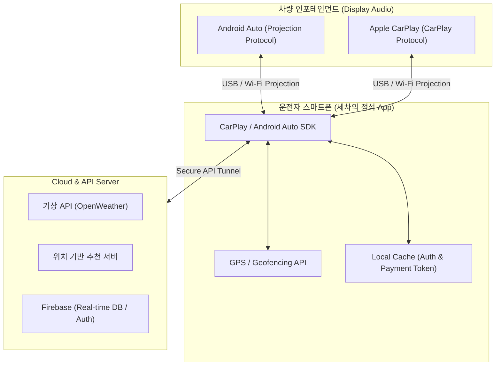

# 🧼 세차의 정석 (The Master of Car Wash) 
> **In-Car Infotainment (Android Auto / Apple CarPlay) UX Extended Architecture**
> 
> "교과서적인 스마트폰 화면을 넘어, 운전자가 진짜 서비스를 소비하는 차량 네비게이션 디스플레이로 UX 생태계를 확장합니다."

---

## 🚗 Project Overview (프로젝트 개요)
기존 모바일 앱 중심의 세차 예약 서비스를 스마트폰 화면(In-App)에만 가두지 않고, 차량 인포테인먼트 시스템(**Android Auto / Apple CarPlay**)과 USB 및 무선으로 연동합니다. 운전석에 앉아 차량 내비게이션 화면만으로 실시간 도장면 케어 알림, 세차장 예약, 자동 체크인까지 원스톱으로 해결하는 **'드라이버 중심의 실전형 카케어 UX 플랫폼'**입니다.

---

## 🛠️ Key Features & In-Car UX (핵심 기능 및 차량 내 UX 동선)

### 1. 실시간 주행 데이터 연동 알림 (Smart Driving Alert)
*   **Context-Aware 팝업**: 차량 GPS 기반 기상 데이터(우천, 황사 등) 및 장거리 주행 데이터를 분석하여, 차량 시동을 끄거나 신호 대기 시 네비게이션 화면에 세차 타이밍 알림을 직관적으로 노출합니다.
*   **Actionable UI**: 알림을 터치하는 순간, 복잡한 뎁스 없이 바로 근처 '세차의 정석' 최적 동선 제휴점 추천 화면으로 전환됩니다.

### 2. 차량 디스플레이 최적화 1-Touch 예약/결제 (In-Car Reservation)
*   **드라이빙 안전 가이드 적용**: 주행 중 조작을 최소화하기 위해 큼직하고 시인성 높은 버튼 배치(Big Button UI)를 채택했습니다.
*   **간편 결제 스킵**: 연동된 차량 내 간편 결제 시스템을 통해 운전석에서 터치 단 한 번으로 예약을 확정합니다.

### 3. 세차장 진입 시 자동 무인 체크인 (Geofencing Welcome System)
*   **비대면 프리패스 동선**: 예약된 '세차의 정석' 매장 반경 50m 진입 시, 차량 GPS(Geofencing)가 이를 자동 감지합니다.
*   **실시간 베이(Bay) 안내**: 차량 화면에 `"진훈 오너님 환영합니다. 예약하신 3번 베이로 바로 진입해 주세요."`라는 UI 안내 가이드를 띄워, 현장에서 대기하거나 차에서 내릴 필요 없는 극강의 편리함을 제공합니다.

---

## 📐 Wired & Wireless Connectivity (시스템 연동 구조)

*   **유무선 프로젝션 (Projection Protocol)**: 모바일 기기와 차량 헤드유닛 간의 USB(유선) 혹은 Wi-Fi/Bluetooth(무선) 통신을 통해 화면 정보 및 터치 이벤트를 주고받습니다.
*   **차량용 SDK 적용**: Android Auto의 `Car App Library` 및 Apple CarPlay의 `CarPlay framework` 가이드라인을 엄격히 준수하여 템플릿 기반 안전한 시인성을 보장합니다.
*   **초저지연 GPS 동기화**: 모바일의 기지국 및 GPS 데이터와 차량의 외부 GPS 데이터를 하이브리드로 대조하여 정밀한 지오펜싱(Geofencing)을 구현합니다.
